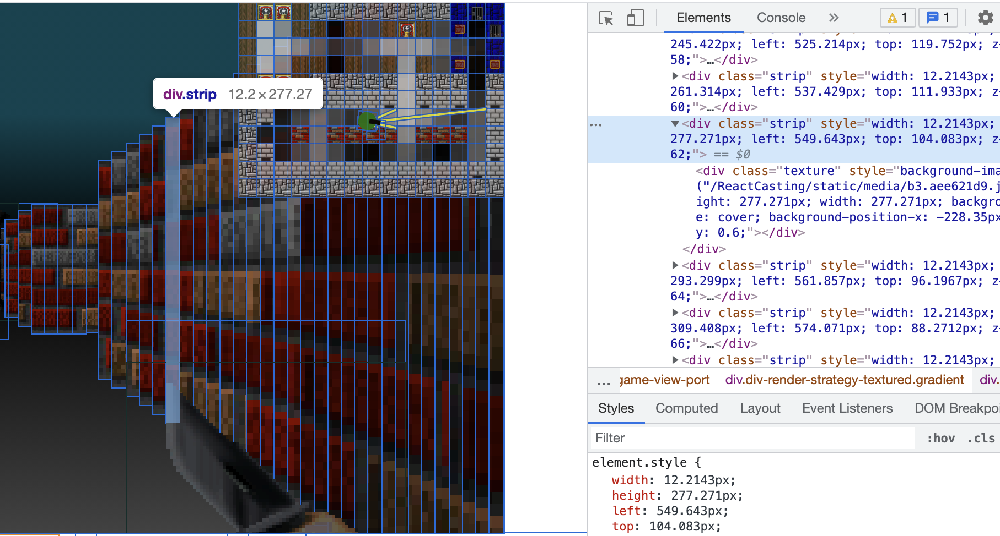

# ReactCasting

Raycasting algorithm that renders pseudo 3D scene in HTML using React (no canvas) and renders as text in textarea or console

## Features

- Textures
- Sprites
- Simple lighting system
- Rendering scene in \<textarea>
- Rendering scene in Chrome console

### Rendering scene using \
 elements

Everything you see is built by HTML5 \
 using React

### Rendering scene as text inside \<textarea>

### Rendering scene as text inside browser console

Works correct only in Google Chrome

## Inspired by

- [A first-person engine in 265 lines](https://www.playfuljs.com/a-first-person-engine-in-265-lines/)
- [HTML5 raycasting demo using React](https://github.com/ahuth/raycast)
