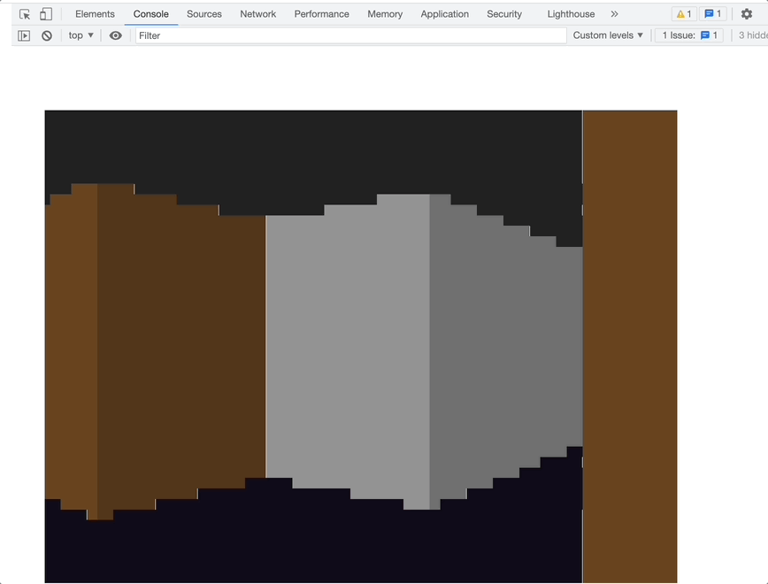

# ReactCasting

Raycasting algorithm that renders pseudo 3D scene in HTML using React (no canvas) and renders as text in textarea or console

[Live demo](https://yurkagon.github.io/ReactCasting/)

WASD - to move

QE - to rotate

## Features

- Textures
- Sprites
- Simple lighting system
- Rendering scene in \<textarea>
- Rendering scene in Chrome console

### Rendering scene using \
 elements

Everything you see is built by HTML5 \
 using React

### Rendering scene as text inside \<textarea>

### Rendering scene inside Chrome console 🥲
Works correct only in Google Chrome

### Rendering scene as text inside browser console
Works correct only in Google Chrome

## Also

- [Check my HTML based 3D Shooter implemented without Canvas](https://github.com/yurkagon/Doom-Nukem-CSS)

## Inspired by

- [A first-person engine in 265 lines](https://www.playfuljs.com/a-first-person-engine-in-265-lines/)

## Contributors

